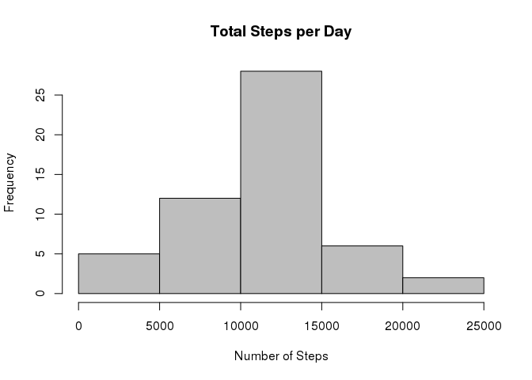
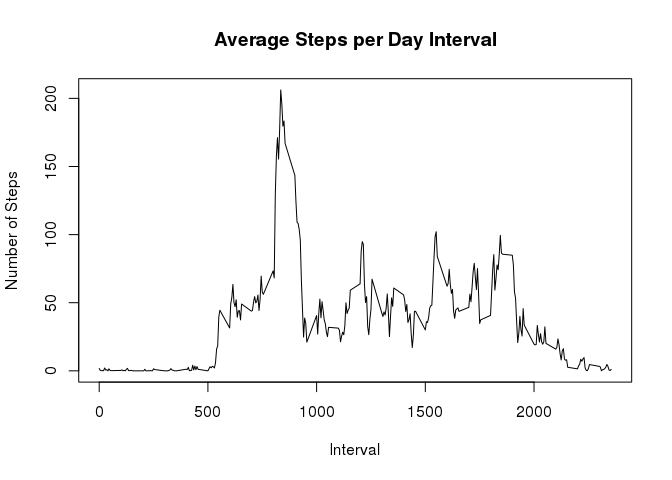
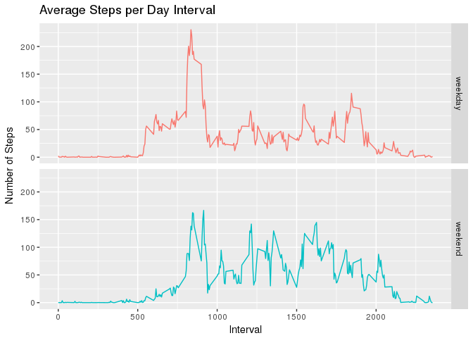

# Reproducible Research: Peer Assessment 1

First I load two helper libraries, 

```r
library(dplyr)
```

```
## 
## Attaching package: 'dplyr'
```

```
## The following objects are masked from 'package:stats':
## 
##     filter, lag
```

```
## The following objects are masked from 'package:base':
## 
##     intersect, setdiff, setequal, union
```

```r
library(ggplot2)
```

## Loading and preprocessing the data

Show any code that is needed to

1. Load the data (i.e. read.csv())

```r
targetDir <- "."
fileURL <- "https://d396qusza40orc.cloudfront.net/repdata/data/activity.zip"

datasetZipFile <-file.path(targetDir, basename(fileURL))
if(!file.exists(datasetZipFile)) {
    download.file(fileURL,destfile=datasetZipFile)
}
rawdata <- unzip(zipfile=datasetZipFile)
activity_raw <- read.csv(rawdata, header=TRUE)
rm(rawdata)
```

2. Process/transform the data (if necessary) into a format suitable for your analysis

```r
activity_raw$date <- as.Date(activity_raw$date, "%Y-%m-%d")
activity <- activity_raw %>% na.omit()
```


## What is mean total number of steps taken per day?

For this part of the assignment, you can ignore the missing values in the dataset.

1. Make a histogram of the total number of steps taken each day


```r
stepsPerDay <- aggregate(steps ~ date, activity, sum)
hist(stepsPerDay$steps, main = paste("Total Steps per Day"), col="grey", xlab="Number of Steps")
```

<!-- -->

2. Calculate and report the mean and median total number of steps taken per day

```r
meanSteps <- mean(stepsPerDay$steps)
medianSteps <- median(stepsPerDay$steps)
```
- **mean(total steps/day) = 10766.19**
- **median(total steps/day) = 10765.00**

## What is the average daily activity pattern?

1. Make a time series plot (i.e. type = "l") of the 5-minute interval (x-axis) and the average number of steps taken, averaged across all days (y-axis)

```r
stepsPerInterval <- aggregate(steps ~ interval, activity, mean)
plot(stepsPerInterval$interval, stepsPerInterval$steps, type="l", xlab="Interval", ylab="Number of Steps",
     main="Average Steps per Day Interval")
```

<!-- -->


2. Which 5-minute interval, on average across all the days in the dataset, contains the maximum number of steps?

```r
maxInterval <- stepsPerInterval$interval[which.max(stepsPerInterval$steps)]
```
- **MAX(206.17) at 5-min Interval = 835**

## Imputing missing values
Note that there are a number of days/intervals where there are missing values (coded as NA). The presence of missing days may introduce bias into some calculations or summaries of the data.

1. Calculate and report the total number of missing values in the dataset (i.e. the total number of rows with NAs)

```r
missing <- sum(!complete.cases(activity_raw))
```
- **Missing values = 2304**

2. Devise a strategy for filling in all of the missing values in the dataset. The strategy does not need to be sophisticated. For example, you could use the mean/median for that day, or the mean for that 5-minute interval, etc.

```r
handle_missing <- function(steps, interval) {
  if(is.na(steps)) { 
    value <- stepsPerInterval$steps[which(stepsPerInterval$interval == interval)]
  } else {
    value <- steps
  }
  return(value)
}
```

3. Create a new dataset that is equal to the original dataset but with the missing data filled in.

```r
imputed_activity <- activity_raw
imputed_activity$steps <- mapply(handle_missing, imputed_activity$steps, imputed_activity$interval)
```

4. Make a histogram of the total number of steps taken each day and Calculate and report the mean and median total number of steps taken per day. Do these values differ from the estimates from the first part of the assignment? What is the impact of imputing missing data on the estimates of the total daily number of steps?

```r
imputedStepsPerDay <- aggregate(steps ~ date, activity, sum)
hist(imputedStepsPerDay$steps, main = paste("Total Steps per Day"), col="grey", xlab="Number of Steps")
```

<!-- -->


```r
imputedMeanSteps <- mean(imputedStepsPerDay$steps)
imputedMedianSteps <- median(imputedStepsPerDay$steps)
diffMean <- imputedMeanSteps - meanSteps
diffMedian <- imputedMedianSteps - medianSteps
```
- **NEW mean(total steps/day) = 10766.19 diff(0)**
- **NEW median(total steps/day) = 10765.00 diff(0)**


## Are there differences in activity patterns between weekdays and weekends?
For this part the weekdays() function may be of some help here. Use the dataset with the filled-in missing values for this part.

1. Create a new factor variable in the dataset with two levels – “weekday” and “weekend” indicating whether a given date is a weekday or weekend day.

```r
# I know its not pretty, but avoids any locale issues 
sat_dow <- strftime(as.Date("19-11-2016", "%d-%m-%Y"), "%u") 
sun_dow <- strftime(as.Date("20-11-2016", "%d-%m-%Y"), "%u")
imputed_activity$dayOfWeek <- ifelse(strftime(imputed_activity$date,"%u") %in% c(sat_dow, sun_dow),
                                     "weekend", "weekday")
imputed_activity$dayOfWeek <- as.factor(imputed_activity$dayOfWeek)
```

2. Make a panel plot containing a time series plot (i.e. type = "l") of the 5-minute interval (x-axis) and the average number of steps taken, averaged across all weekday days or weekend days (y-axis). See the README file in the GitHub repository to see an example of what this plot should look like using simulated data.

```r
stepsPerIntervalDayOfWeek <- aggregate(steps ~ interval + dayOfWeek, imputed_activity, mean)
p<-ggplot(stepsPerIntervalDayOfWeek, aes(interval, steps)) +
  facet_grid(dayOfWeek ~ . ,scales = "fixed") +
  ggtitle("Average Steps per Day Interval") + 
  xlab("Interval") + 
  ylab("Number of Steps") +
  geom_line(aes(color=dayOfWeek)) +
  theme(legend.position="none")
print(p)
```

<!-- -->

